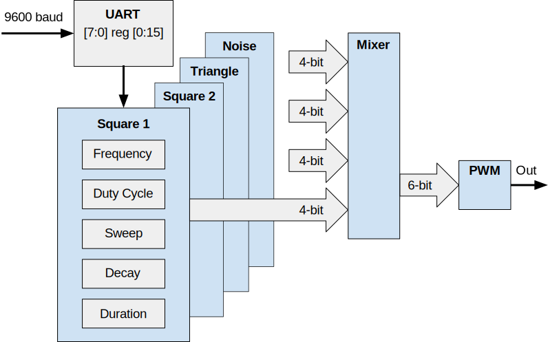

  

# Overview

This project replicates the Audio Processing Unit (APU) of vintage video games.
Separate PWM outputs are provided for each sound engine, allowing NES game music to be externally mixed into stereo or surround sound.

# Statistics

- Tiles: 1x2
- DFF: 458
- Total Cells: 2760
- Utilization: 72%

# TinyTapeout 5 Configuration

TT05 devices from the eFabless Multi-Project Wafer (MPW) shuttle are delivered in QFN-64 packages, mounted on a daughterboard for breakout.

Based on data from:
- https://github.com/WallieEverest/tt04

## Changes from TT04
- Static registers addressed by the serial UART have been connected to an external reset, providing a known startup configuration.
- Default values for REG signals have been removed, allowing 'X' propagation during simulation until the design reaches steady state.

# How to test

The ChipTune project can be interfaced to a computer COM port (9600,n,8,1).
An analog PWM filter and audio driver are needed for the test rig.

## Inputs

- CLK is a 1.789733 MHz clock
- RST_N is an active-low asynchronous reset
- RX

## Outputs

- BLINK is an LED status indicator with a 1 Hz rate
- LINK is an LED activity indicator of the RX signal
- TX generates a frame synchonization character (0x80)
- PWM is the pulse-width modulated audio output summed for all channels
- SQUARE1 is the PWM for addresses 0 through 3
- SQAURE2 is the PWM for addresses 4 through 7
- TRIANGLE is the PWM for addresses 8 through 11
- NOISE is the PWM for addresses 12 through 15

## Bidirectional

- None

## Design For Test Considerations

All relevant signals are available on the motherboard's PMOD connectors. The system clock is generated on the motherboard.

# Summary

An external serial port can play synthetic game music through this TT05 project.
